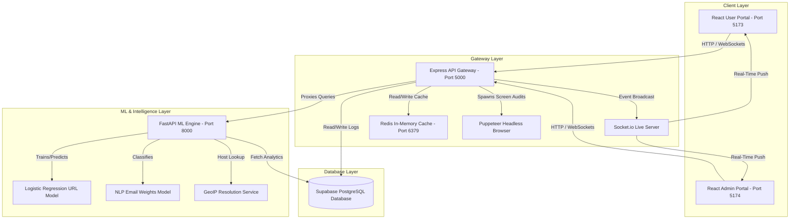
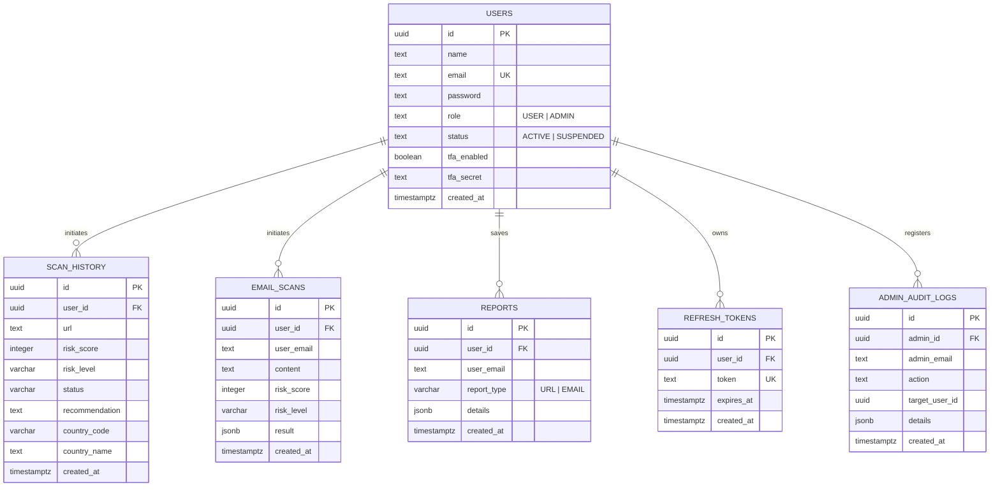
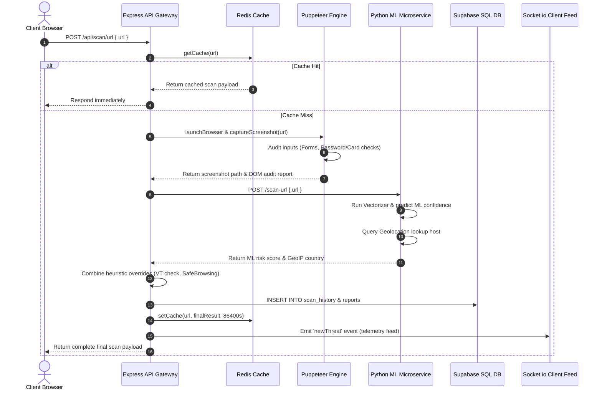
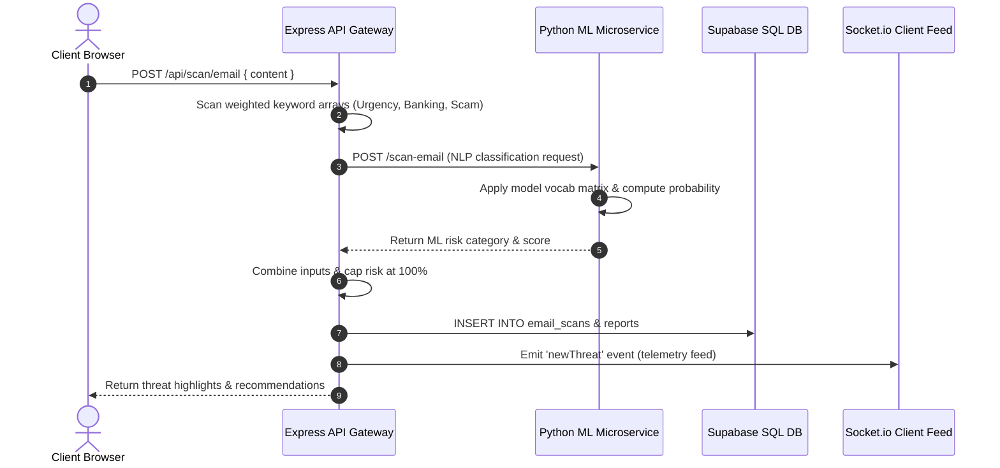
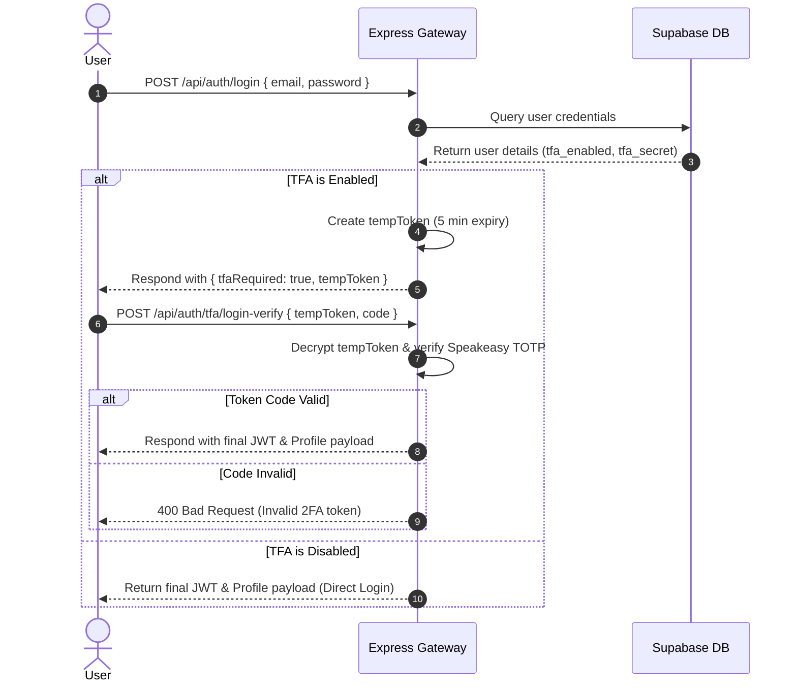

# SentinelScan AI: Enterprise-Grade Phishing Detection Platform

SentinelScan AI is a state-of-the-art, full-stack cybersecurity web intelligence platform designed to scan, detect, and analyze phishing threats across URLs and email structures in real-time. By coupling a high-performance Node.js API Gateway with an advanced Python Machine Learning microservice, the platform combines heuristic analysis, visual DOM inspections, reputation indicators, and character-level ML classification models to shield individuals and organization workspaces from credential theft, financial scams, and brand spoofing.

---

## 📌 Problem Statement & Objectives

### The Problem
Traditional anti-phishing solutions rely heavily on static blacklists (such as Google Safe Browsing or VirusTotal feeds). While effective for known threats, these databases fail to address:
1. **Zero-Day Phishing**: New, short-lived domains configured minutes before an attack.
2. **Brand Mimicry**: URL structures mimicking official portals (e.g., `login-paypal-verify-secure.net`) which bypass structural domain filters.
3. **Deceptive DOM Inputs**: Clean site reputations hosting forms that harvest credentials or credit card numbers dynamically.

### Objectives
- Provide a unified dashboard displaying live threats, scan activity, and geographical origins of attackers.
- Implement lexical and structural Machine Learning classifiers capable of identifying zero-day phishing patterns without static reputation list dependencies.
- Conduct automated visual and DOM-level audits via headless browser automation to evaluate forms prompting for sensitive inputs.
- Establish hardened authentication controls (HTTP-only refresh tokens, multi-factor TOTP secrets) and centralized administrative audit traces.

---

## ⚙️ High-Level Technical Architecture

The platform operates on a decentralized microservices architecture comprising two frontend portals (User and Admin), an Express.js API gateway, a FastAPI Machine Learning prediction engine, a Redis caching registry, and a Supabase SQL data store.

### System Topology Map



---

## 📂 Project Structure & Component Flow

The repository is structured into four main isolated layers:

```txt
Project-10---AI-Phishing-Detection-Platform/
│
├── backend-node/               # Express Gateway (JWT, Rate Limiter, Puppeteer, Redis)
│   ├── src/
│   │   ├── config/             # DB Client SDK config (Supabase client init)
│   │   ├── controllers/        # Route Handlers (auth, admin, reports, analytics)
│   │   ├── middleware/         # Security guards (JWT guard, AdminOnly role filter)
│   │   ├── routes/             # Express API Pathways (scans, auth, history, analytics)
│   │   ├── services/           # Service Integrations (Puppeteer, Redis, Socket, VirusTotal)
│   │   ├── utils/              # Heuristic scanners, token helpers, URL normalizers
│   │   └── index.js            # Node Server entrypoint (Port 5000)
│   └── package.json            # Gateway dependencies
│
├── backend-python/             # FastAPI Machine Learning & Geolocation Engine
│   ├── app/
│   │   ├── config.py           # Dotenv settings configuration manager
│   │   ├── main.py             # FastAPI App instance and route endpoints (Port 8000)
│   │   ├── schemas/            # Pydantic schema validation structures
│   │   └── services/           # AI services (ML URL/Email classifiers, GeoIP locator)
│   └── requirements.txt        # Python ML libraries (FastAPI, Scikit-learn, Pandas)
│
├── frontend-user/              # React User portal client (Vite, Recharts, SVG Threat Map)
│   ├── src/
│   │   ├── components/         # Shared layouts (Navigation sidebar, cards)
│   │   ├── pages/              # Views (Dashboard, Scanners, History, Reports)
│   │   ├── services/           # API handlers (Axios client config)
│   │   └── index.css           # Premium Slate/Glassmorphism styling
│   └── package.json            # User application dependencies
│
├── frontend-admin/             # React System Administration console client
│   ├── src/
│   │   ├── components/         # Navigation sidebars
│   │   └── pages/              # Views (User listing, Scan logs, Live telemetry)
│   └── package.json            # Operator app dependencies
│
└── supabase_setup.sql          # DB Migration script (users, scans, tokens, audit logs)
```

### Folder Responsibilities & Data Flows

#### 1. `backend-node/`
* **Purpose**: Serves as the primary entry point for user client traffic. It manages authentication sessions, rate limits brute force attempts, controls browser-automation screenshots, coordinates caching, and saves detailed findings to the database.
* **Key Files**: 
  - [index.js](file:///c:/Users/ANSARI%20MOHAMMED/OneDrive/Desktop/Internship/Labmentix/Project%2010%20-%20Majer%20Project%20-%20Web%20-%20AI%20Phishing%20Detection%20Platform/backend-node/src/index.js): Binds middleware, instantiates HTTP wrappers, and initiates Redis and Socket.io instances.
  - [urlScanner.js](file:///c:/Users/ANSARI%20MOHAMMED/OneDrive/Desktop/Internship/Labmentix/Project%2010%20-%20Majer%20Project%20-%20Web%20-%20AI%20Phishing%20Detection%20Platform/backend-node/src/routes/urlScanner.js): Consolidates heuristics, Redis caching, Puppeteer screenshots, and FastAPI prediction queries.
* **Dependencies**: `express`, `@supabase/supabase-js`, `puppeteer`, `redis`, `socket.io`, `helmet`, `express-rate-limit`, `speakeasy`, `qrcode`.
* **Data Flow**: Captures incoming URLs -> queries Redis cache -> triggers Puppeteer for page snapshot and DOM inspection -> requests Python microservice prediction and GeoIP -> stores results in Supabase -> broadcasts threat socket alerts -> returns payload to user.

#### 2. `backend-python/`
* **Purpose**: Performs high-performance computation tasks: trains lexical classification models, parses text semantics, computes daily trends, and maps hostnames to geographical countries.
* **Key Files**:
  - [main.py](file:///c:/Users/ANSARI%20MOHAMMED/OneDrive/Desktop/Internship/Labmentix/Project%2010%20-%20Majer%20Project%20-%20Web%20-%20AI%20Phishing%20Detection%20Platform/backend-python/app/main.py): Registers FastAPI routers for analytics, search filters, and prediction runs.
  - [ml_classifier.py](file:///c:/Users/ANSARI%20MOHAMMED/OneDrive/Desktop/Internship/Labmentix/Project%2010%20-%20Majer%20Project%20-%20Web%20-%20AI%20Phishing%20Detection%20Platform/backend-python/app/services/ml_classifier.py): Implements model vectorization, lexical override checks, and training pipelines.
* **Dependencies**: `fastapi`, `uvicorn`, `scikit-learn`, `pandas`, `numpy`, `requests`.
* **Data Flow**: Accepts URL/Email data from Node.js Gateway -> applies character n-gram TF-IDF vectorization -> feeds data into trained Logistic Regression classifier -> evaluates threat probabilities -> returns confidence scores.

#### 3. `frontend-user/` & `frontend-admin/`
* **Purpose**: User-facing React clients. The user portal focuses on individual diagnostic scanners, report histories, and PDF exports. The admin portal allows operators to review database records, track audit trails, manage active users, and monitor telemetry.
* **Dependencies**: `react`, `react-router-dom`, `recharts`, `socket.io-client`, `html2pdf.js`, `lucide-react`, `tailwindcss`.
* **Data Flow**: Standard user logs in (or configures TOTP 2FA) -> submits link for analysis -> receives dynamic update feed via socket listeners -> generates dashboard visuals via Recharts components -> exports visual reports to local PDF.

---

## 🛠️ Feature Documentation

The platform features are divided into core platform functionalities and the 6 newly integrated enterprise-grade enhancements.

### A. Core Features

#### 1. Heuristic URL Analyzer
* **Purpose**: Performs real-time structural tests on target URLs to detect common phishing patterns immediately.
* **User Benefit**: Flags low-hanging phishing attempts instantly, avoiding the latency of third-party API lookups.
* **Technical Implementation**: Evaluates targets using structured JavaScript patterns: checks for SSL protocol absence (`http://`), counts hyphens count (flags `>= 3` as suspicious), measures string lengths (flags `> 60` characters), checks for raw IP address hosts, and executes brand imitation checks (e.g., matching substring `paypal` on unauthorized host domains).
* **Technologies Used**: JavaScript Regex engine, URI normalizers.
* **Future Enhancements**: Implement dynamic edit-distance algorithms (e.g., Levenshtein distance) to flag typo-squatting variants of thousands of global brand names automatically.

#### 2. Reputation Verification Engine (VirusTotal & Google Safe Browsing)
* **Purpose**: Validates target URLs against industry-standard malware and phishing databases.
* **User Benefit**: Cross-references links with security vendors to guarantee comprehensive coverage of known malicious entities.
* **Technical Implementation**: Express Gateway issues requests to the VirusTotal v3 domain report API. Simultaneously, the Python backend queries the Google Safe Browsing v4 Threat Matches API.
* **Technologies Used**: REST API integration, Node Axios wrapper, Python Requests engine.
* **Future Enhancements**: Implement recursive redirects tracking (unwrapping shortened URLs like `bit.ly` or `t.co`) to inspect destination domains rather than initial redirection domains.

#### 3. Structural Email Text Analyzer
* **Purpose**: Inspects email body copy for social engineering indicators, panic markers, and scam prompts.
* **User Benefit**: Protects operators from spear-phishing and business email compromise (BEC) attacks by flagging psychological triggers.
* **Technical Implementation**: Scans text copy against lexical groups. Evaluates cumulative weights: Urgency keywords (e.g., `verify now`, `urgent update`: +10), Banking details (e.g., `credit card`, `wire transfer`: +15), and Scam indicators (e.g., `bitcoin prize`, `lottery winner`: +10) capped at 100%.
* **Technologies Used**: Express JS keyword matrices, email parser middleware.
* **Future Enhancements**: Add optical character recognition (OCR) parsing to evaluate text embedded within email flyer attachments or images.

#### 4. Historical Scanning Archives & Search Filters
* **Purpose**: Provides persistent history of all scans and diagnostic threat reports.
* **User Benefit**: Allows users to review historical scan data and compare results.
* **Technical Implementation**: Queries are processed via the python search microservice `/api/history` and `/api/reports` proxying Supabase database tables with strict SQL filters.
* **Technologies Used**: PostgreSQL database schemas, Pydantic search models, Python FastAPI search APIs.
* **Future Enhancements**: Implement bulk historical exports (supporting Excel, JSON formats) and search automation via scheduled security cron queries.

---

### B. Enhanced Features & Improvements (The 6 Platform Enhancements)

#### 1. FastAPI Machine Learning Classifier
* **Purpose**: Flags zero-day phishing attempts that bypass standard heuristic checks and database signatures.
* **User Benefit**: Provides proactive protection against brand-new malicious domains by analyzing domain patterns.
* **Technical Implementation**: The Python backend trains a Logistic Regression model on startup using character-level TF-IDF vectorization (3-to-5 character n-gram bounds) for URLs, and a separate vocabulary term-frequency model for email text copy. If the model prediction probability exceeds threshold levels, it flags the threat.
* **Technologies Used**: `scikit-learn`, `pandas`, `numpy`, `FastAPI` (exposed at `/scan-url`).
* **Future Enhancements**: Implement automated model retraining cycles by pulling new flagged telemetry data directly from Supabase.

#### 2. Headless Browser Audits (Puppeteer Screenshots & DOM Scans)
* **Purpose**: Captures visual screenshots and audits form input elements on target domains to identify dynamic credential harvesting.
* **User Benefit**: Allows users to preview site pages safely in the dashboard without risking browser exposure.
* **Technical Implementation**: Gateway spawns a headless Puppeteer browser instance on target URLs. It captures a `1280x720` screenshot and evaluates DOM inputs (e.g., checking if password/credit card fields are served on suspicious or unverified hosts).
* **Technologies Used**: `puppeteer` (headless configuration, sandbox-disabled arguments).
* **Future Enhancements**: Implement visual similarity scanning (using pixel-wise structural similarity index metrics - SSIM) to compare captured page layouts with official login pages.

#### 3. WebSockets Live Telemetry Feed
* **Purpose**: Streams system telemetry and scan occurrences in real-time.
* **User Benefit**: Keeps dashboards updated automatically without requiring manual refreshes.
* **Technical Implementation**: Initiates a Socket.io server alongside the Express listener. Whenever the scan route completes, it fires a `newThreat` WebSocket event containing URL details, risk level, score, and origin country.
* **Technologies Used**: `socket.io`, `socket.io-client`.
* **Future Enhancements**: Add real-time administrator chat utilities to coordinate incident responses during attacks.

#### 4. Auth Hardening (Speakeasy 2FA & Refresh Tokens)
* **Purpose**: Restricts user account control pathways and administrative controls to verified, multi-factor operator sessions.
* **User Benefit**: Ensures that admin consoles and scan logs remain secured even if login credentials are leaked.
* **Technical Implementation**: Implements Google Authenticator TOTP configuration. The backend generates base32 secrets, registers them to user accounts, and returns QR code URLs via `qrcode`. Step-up login screens challenge operators for 6-digit TOTP codes using JWT temp token payloads.
* **Technologies Used**: `speakeasy`, `qrcode`, `jsonwebtoken`.
* **Future Enhancements**: Support hardware security keys (FIDO2 / WebAuthn passwordless options).

#### 5. Caching & Global Rate Limiting
* **Purpose**: Restricts API abuse and prevents gateway server outages from duplicate scan queries.
* **User Benefit**: Provides immediate scan returns for previously evaluated domains while maintaining API stability.
* **Technical Implementation**: Binds a Redis caching wrapper checking keys (`scan:url:<URL>`) before initiating external scans. Binds `express-rate-limit` restricting requests to 150 operations per 15 minutes globally, and 20 login attempts per 15 minutes.
* **Technologies Used**: `redis` (in-memory keyspace), `express-rate-limit` middleware.
* **Future Enhancements**: Transition local Redis nodes to distributed elastic clusters.

#### 6. Premium Dashboards, Maps & PDF Reports
* **Purpose**: Displays system telemetry visually and enables off-site report sharing.
* **User Benefit**: Offers clear visual insights into system status and makes report distribution easy.
* **Technical Implementation**: Renders Area and Pie charts via Recharts. Integrates an interactive SVG Global Threat Map utilizing country metadata (US, NL, DE, CN) to render glowing threat nodes with hover details. Exports report components to PDF via `html2pdf.js`.
* **Technologies Used**: `recharts`, `html2pdf.js`, SVG vector graphics.
* **Future Enhancements**: Extend threat maps to visualize real-time attack vector pathways connecting host origins to user targets.

---

## 🛠️ Technology Stack & Versions

| Layer | Technology / Package | Version | Purpose |
| :--- | :--- | :--- | :--- |
| **Frontend Core** | React | `^19.2.6` | Client Interface Logic |
| **Frontend Routing** | React Router DOM | `^7.15.1` | Application Routing |
| **Visual Charts** | Recharts | `^2.7.0` | Telemetry Data Visualizations |
| **PDF Generation** | html2pdf.js | `^0.10.1` | Report Exports |
| **Styling** | Tailwind CSS / Vite | `^4.3.0` | Theme Design |
| **WebSockets (Client)** | socket.io-client | `^4.7.0` | Real-Time Telemetry Detections |
| **Backend Core** | Express.js | `^5.2.1` | API Gateway Gateway |
| **DB Connector** | Supabase JS SDK | `^2.106.1`| Data Operations |
| **Headless Browser** | Puppeteer | `^21.0.0` | Page Auditing & Screenshots |
| **In-Memory Caching** | Redis Node client | `^4.6.0` | Scan Result Caching |
| **MFA Cryptography** | Speakeasy / QRCode | `^2.0.0` | Multi-Factor Authentication |
| **Rate Limiter** | express-rate-limit | `^6.9.0` | Brute Force Protection |
| **ML Microservice** | FastAPI / Uvicorn | `^0.95.0` | Python AI Engine hosting |
| **ML Computation** | scikit-learn | `^1.2.0` | Classifier training & predictions |
| **Data Frames** | pandas / numpy | `^1.5.0` | Analytical processing |

---

## 🔒 Security Architecture

The platform implements security measures to ensure data integrity and system availability:

1. **Role-Based Access Control (RBAC)**: Users and Admin scopes are separated using JWT role claims (`USER`, `ADMIN`). Sensitive routes (like user management and system logs auditing) verify the admin claim using the `adminOnly` middleware.
2. **Speakeasy TOTP Multi-Factor Authentication**: Generates cryptographic secrets to register secure user logins. Challenge checkpoints verify user tokens using a clock tolerance window of 1 (`window: 1`).
3. **API Rate Limiting**: Global route protection limits requests to prevent denial-of-service (DoS) attempts, while authentication endpoints are limited to block brute-force login attempts.
4. **Helmet Headers & CORS Policies**: Registers security headers to mitigate cross-site scripting (XSS), clickjacking, and mime-type sniffing. Implements strict CORS policies on the gateway to control cross-origin access.
5. **SQL Injection & Data Validation Prevention**: Supabase database transactions utilize parameterized queries via the Supabase Client SDK, preventing raw SQL payload execution. Incoming JSON payloads are parsed and validated to block input injection.

---

## 📊 Database Schema Documentation

The platform uses a PostgreSQL database schema managed through Supabase.

### Entity Relationship Diagram (ERD)



---

## ⚡ Application Workflows

### 1. URL Detection Workflow



### 2. Email Detection Workflow



### 3. User Authentication Workflow (With hardened Speakeasy 2FA)



---

## 📡 API Reference Documentation

### Authentication Endpoints

#### Register User
* **Method**: `POST`
* **Route**: `/api/auth/register`
* **Request Body**:
  ```json
  {
    "name": "Alex Operator",
    "email": "alex@sentinelscan.com",
    "password": "SecurePassword123!",
    "role": "USER"
  }
  ```
* **Response (201 Created)**:
  ```json
  {
    "success": true,
    "data": {
      "id": "a1b2c3d4-e5f6-7a8b-9c0d-1e2f3a4b5c6d",
      "name": "Alex Operator",
      "email": "alex@sentinelscan.com",
      "role": "USER",
      "status": "ACTIVE",
      "token": "eyJhbGciOiJIUzI1Ni..."
    }
  }
  ```

#### Login User
* **Method**: `POST`
* **Route**: `/api/auth/login`
* **Request Body**:
  ```json
  {
    "email": "alex@sentinelscan.com",
    "password": "SecurePassword123!"
  }
  ```
* **Response (2FA Enabled - 200 OK)**:
  ```json
  {
    "success": true,
    "tfaRequired": true,
    "tempToken": "eyJhbGciOiJIUzI1NiJ9.ey..."
  }
  ```

#### Verify 2FA Login
* **Method**: `POST`
* **Route**: `/api/auth/tfa/login-verify`
* **Request Body**:
  ```json
  {
    "tempToken": "eyJhbGciOiJIUzI1NiJ9.ey...",
    "code": "123456"
  }
  ```
* **Response (200 OK)**:
  ```json
  {
    "success": true,
    "data": {
      "id": "a1b2c3d4-e5f6-7a8b-9c0d-1e2f3a4b5c6d",
      "name": "Alex Operator",
      "email": "alex@sentinelscan.com",
      "role": "USER",
      "status": "ACTIVE",
      "token": "eyJhbGciOiJIUzI1Ni..."
    }
  }
  ```

### Scanning Endpoints

#### Scan URL
* **Method**: `POST`
* **Route**: `/api/scan-url`
* **Headers**: `Authorization: Bearer <token>`
* **Request Body**:
  ```json
  {
    "url": "http://login-paypal-security-update.com/signin"
  }
  ```
* **Response (200 OK)**:
  ```json
  {
    "success": true,
    "data": {
      "url": "http://login-paypal-security-update.com/signin",
      "domainExists": true,
      "riskScore": 85,
      "riskLevel": "HIGH",
      "status": "Potential Phishing Website",
      "recommendation": "Avoid Visiting",
      "checks": {
        "https": false,
        "keywords": true,
        "virusTotal": false,
        "googleSafeBrowsing": true,
        "domPhishing": true
      },
      "reasons": [
        "URL does not use HTTPS",
        "Suspicious keyword(s) detected: login, paypal, signin",
        "Google Safe Browsing flagged as unsafe (SOCIAL_ENGINEERING)",
        "Deceptive form audit: Password inputs detected on suspicious domain"
      ],
      "screenshot": "/screenshots/a9b8c7d6.png",
      "geolocation": {
        "ip": "104.21.34.112",
        "country_code": "NL",
        "country_name": "Netherlands"
      }
    }
  }
  ```

---

## 🛠️ Installation & Setup Guide

### Prerequisites
- [Node.js](https://nodejs.org/) (v18 or higher recommended)
- [Python](https://www.python.org/) (v3.9 or higher recommended)
- [Supabase Account](https://supabase.com/) (Free tier PostgreSQL database instance)
- [Redis Server](https://redis.io/) (Optional; falls back to mock memory registry if offline)

### 1. Database Table Configurations (Supabase DDL)
1. Navigate to your **Supabase Project Dashboard** -> **SQL Editor** -> Click **New Query**.
2. Run the SQL statements inside [supabase_setup.sql](file:///c:/Users/ANSARI%20MOHAMMED/OneDrive/Desktop/Internship/Labmentix/Project%2010%20-%20Majer%20Project%20-%20Web%20-%20AI%20Phishing%20Detection%20Platform/supabase_setup.sql) to set up tables (`users`, `scan_history`, `email_scans`, `reports`, `refresh_tokens`, `admin_audit_logs`).
3. Set user permissions. To connect from your local development environment:
   ```sql
   ALTER TABLE public.users DISABLE ROW LEVEL SECURITY;
   ALTER TABLE public.scan_history DISABLE ROW LEVEL SECURITY;
   ALTER TABLE public.email_scans DISABLE ROW LEVEL SECURITY;
   ALTER TABLE public.reports DISABLE ROW LEVEL SECURITY;
   ALTER TABLE public.refresh_tokens DISABLE ROW LEVEL SECURITY;
   ALTER TABLE public.admin_audit_logs DISABLE ROW LEVEL SECURITY;
   ```

### 2. Node.js API Gateway Setup
1. Navigate to the API gateway directory:
   ```bash
   cd backend-node
   ```
2. Install dependencies:
   ```bash
   npm install
   ```
3. Configure your local environment variables in `backend-node/.env`:
   ```env
   PORT=5000
   JWT_SECRET=supersecretjwtkeyforphishguard123!
   SUPABASE_URL=https://<your-project-id>.supabase.co
   SUPABASE_ANON_KEY=<your-supabase-anon-key>
   VIRUSTOTAL_API_KEY=<your-virustotal-api-key>
   PYTHON_BACKEND_URL=http://localhost:8000
   ```
4. Start the development server:
   ```bash
   npm run dev
   ```

### 3. Python FastAPI ML Microservice Setup
1. Navigate to the Python microservice directory:
   ```bash
   cd backend-python
   ```
2. Create and activate a virtual environment:
   ```bash
   python -m venv venv
   # On Windows:
   venv\Scripts\activate
   # On macOS/Linux:
   source venv/bin/activate
   ```
3. Install ML dependencies:
   ```bash
   pip install -r requirements.txt
   ```
4. Configure variables in `backend-python/.env`:
   ```env
   GOOGLE_SAFE_BROWSING_API_KEY=<your-safe-browsing-key>
   SUPABASE_URL=https://<your-project-id>.supabase.co
   SUPABASE_ANON_KEY=<your-supabase-anon-key>
   ```
5. Launch the FastAPI server:
   ```bash
   python -m uvicorn app.main:app --reload --port 8000
   ```

### 4. Client Portals Setup (User & Admin)
1. Set up the user frontend portal:
   ```bash
   cd frontend-user
   npm install
   npm run dev
   ```
   *The user interface starts at `http://localhost:5173`.*

2. Set up the admin frontend portal:
   ```bash
   cd ../frontend-admin
   npm install
   npm run dev
   ```
   *The admin interface starts at `http://localhost:5174`.*

---

## 📈 Performance Optimizations

- **Self-Healing Caching Layers**: Scanned URLs are cached in Redis for 24 hours. The caching layer falls back to a clean mock registry if Redis goes offline, preventing server crashes.
- **Microservices Boundary Checks**: Heavy computations (scikit-learn vectorization, Pandas aggregates, GeoIP country scans) are delegated to the Python backend to keep the Node.js API Gateway light and responsive.
- **Fast Puppeteer Navigations**: Puppeteer navigations are configured with a fast timeout limit (`timeout: 8000`) and wait for the `domcontentloaded` lifecycle stage. This speeds up scans by avoiding delays from heavy media files and redirects.

---

## 🔮 Future Roadmap

```txt
  Phase 1: Ecosystem Plugins 🚀
   ├── Chrome/Firefox Browser Extension (inspects active tabs)
   └── Real-time SMTP Email Scanner Integration (evaluates inbox links)
   
  Phase 2: Advanced AI Models 🧠
   ├── Deep Learning architectures (Bi-LSTM / Transformers for sequential text modeling)
   └── Optical Character Recognition (OCR) scanner for text inside attachments
   
  Phase 3: Administrative Utilities 🛡️
   ├── SIEM event forwarder (CEF/LEEF data log mapping streams)
   └── Threat Intelligence Sharing (STIX/TAXII JSON exports)
```

---

## 🤝 Contributors & License
- **Mohammed Ansari** - Team Leader
- **Priyanka** - Team Member
- **Nikita** - Team Member
- **Sandeep** - Team Member

### License & Acknowledgments
- Licensed under the MIT License.
- Acknowledgments to the scikit-learn community, Supabase team, and Puppeteer maintainers.
